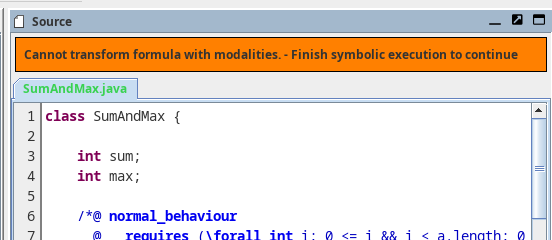
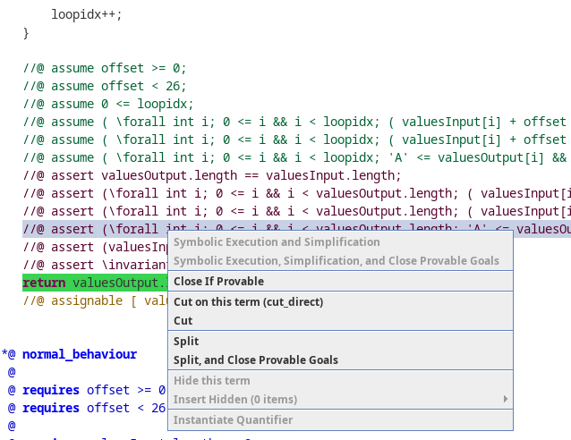

Thank you for participating in the evaluation of the „Extended-KeY-Sourceview“ prototype.

Please download the [evaluation.zip](https://github.com/Mikescher/key-extsourceview-evaluation/raw/master/evaluation.zip) which contains two java programs.
Both contain an implementation of the caesar chiffre algorithm with an accompanying JML specification.
And both contain an error, due to which the specification cannot be proven.

The first file shall be evaluated with the new prototype, and the second with the existing sequent view.  

After both parts, there are a few questions. You can use the *README.odt* document to fill in your answers and sent then send it to me at [ugxvv@student.kit.edu](mailto:ugxvv@student.kit.edu). 

Please follow the instructions: *(All instructions are also included in the README.odt)*

### Preparation

 - Extract the KeY.jar and the two program directories from the evaluation.zip file.
 - Temporarily rename the .key directory in your home folder to ensure that KeY is running with the default settings. You can restore it afterward.

### Usage Notes:

 - This prototype modified the „Source“ windows in KeY.  
   The sequent of the current node is being displayed as JML insertions in the source code.  
   If the sequent cannot be translated, an error is shown (see <a href="#fig1">Fig. 1</a>)
 - Interactions can be done by right-clicking in the source window.  
   Clicking on free space shows general interactions, and clicking on a specific insertion shows actions on this formula (see <a href="#fig2">Fig. 2</a>)
 - To distinguish generated and original source code lines, all generated code has a light gray background.
 - When hovering over insertions, the original JML terms get highlighted with a magenta background.
 - If you encounter errors try extracting the zip file into a directory without whitespaces.
 - The *Cut* and *Instantiate* dialogs still have JavaDL input fields. Even though they can be opened by right-clicking on JML terms.

   

      
      <i>Figure 1: Error message in source view if the symbolic execution wasn't finished.</i>
   

   

      
      <i>Figure 2: Sourceview context menu when right-clicking on an @assert.</i>

   

### Part 1:

1. Launch the Key.jar from the extracted zip file
2. Open the file „CaesarChiffre.key“ in the directory Part_1
3. Hide/Minimize the window "*Sequent*". Only the windows "*Source*", "*Proof*" and "*Loaded Proofs*" should be visible.
4. Start a timer (To later determine the time this part took).
5. Try to identify the reason why the proof does not close automatically.  
   You will later be asked in which line the error is.
6. Stop your timer.

### Questions (Part 1):

*(Please fill in your answers in the README.odt document)*

 - **[1]** Please state your Name.  

 - **[2]** How much time did you need for this part?  

 - **[3]** Did you manage to find the problem in calcChiffre()? What is the error, and where is it?  

 - **[4]** The JML insertions appear in different positions. Which properties do you think determine the position of the insertions?  

 - **[5]** What meaning did you assign to the new  `\old<$num>($term)` syntax? Give a short explanation what such an expression means in a JML term.

### Part 2:

1. Launch the Key.jar from the extracted zip file
2. Open the file „CaesarChiffre.key“ in the directory Part_2
3. Hide/Minimize the window "*Source*". Only the windows "*Sequent*", "*Proof*" and "*Loaded Proofs*" should be visible.
4. You can open the  CaesarChiffre.java file in an external viewer beside the KeY window.
5. Start a timer (To later determine the time this part took).
6. Try to identify the reason why the proof does not close automatically.  
   You will later be asked in which line the error is.
7. Stop your timer.
    
### Questions (Part 2):

 - **[6]** How much time did you need for this part?  

 - **[7]** Did you manage to find the problem in calcChiffre()? What is the error, and where is it?  

 - **[8]** In the new source code view: Which elements of the UI would you like to change?  
       What did you miss in the UI?  

 - **[9]** What additional interactions did you need in the new source code view or would have been useful?  

 - **[10]** Compare the raw sequent view with the new source code window.  
        With which view could you understand the current proof state better?  

 - **[11]** Additional comments:

### Closing:

Thank you for participating in this evaluation.  

Please send your answers to the questions 1 to 11 to me by [email (ugxvv@student.kit.edu)](mailto:ugxvv@student.kit.edu)  

